## Kamień Milowy 1

 

### Problem

 Problem polega na przewidywaniu czasu, po którym dany klient zamierza zakończyć umowę z firmą zajmującą się telekomunikacją. Chcemy ten czas jak najbardziej przedłużyć w celu maksymalizacji dochodów pochodzących ze świadczenia usług internetowych (telewizja, internet światłowodowy itp.) 

### Cel Projektu

 Efektywna kampania marketingowa (predykcja za pomocą algorytmu sztucznej inteligencji), mająca na celu proponowanie klientom lepsze warunki umowy / promocje w przewidzianym okresie, w którym dany klient ma duże prawdopodobieństwo na odstąpienie od niej. 

### Wymagania:

- Zestaw danych dotyczący umów klientów, w szczególności zawierający dane o okresie czasu, po którym klient rozwiązał umowę _[(LINK - Wersja 2017)](https://www.kaggle.com/datasets/blastchar/telco-customer-churn/data)_ _[(Wersja 2019)](https://community.ibm.com/community/user/blogs/steven-macko/2019/07/11/telco-customer-churn-1113)_
- Skalowalność: Wzrost rozmiaru danych wejściowych w realistycznych proporcjach nie powinien zwiększać gwałtownie czasu wykonania modelu.
- Bezpieczeństwo: Model nie powinien ujawniać w żaden sposób danych wrażliwych pochodzących od klientów.

<p align="center"><figure class="figure"><p>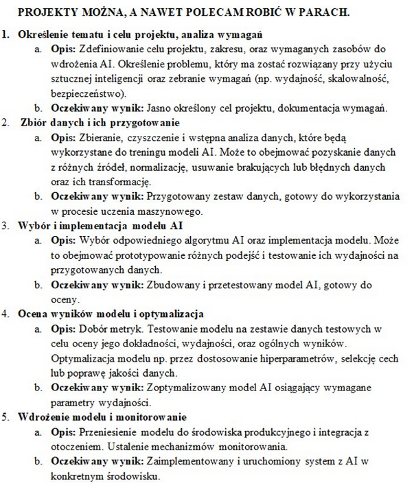</p>
</figure></p>

## Kamień Milowy 2

 

### Opis

 Wybrany zbiór danych przedstawia bazę klientów fikcyjnej firmy telekomunikacyjnej. Głównym celem pracy z tymi danymi jest przewidywanie, który klient zrezygnuje z usług firmy / po jakim czasie zakończy on umowę z firmą (czyli przewidywanie zjawiska Churn). Aby łatwiej było go zrozumieć, te 21 kolumn można podzielić na 4 logiczne kategorie:

1. Dane demograficzne (Kim jest klient?)
   - CustomerID: Unikalny identyfikator klienta (np. 7590-VHVEG). Z punktu widzenia analityki ignoruje się go, bo nie niesie żadnej wiedzy.
   - gender: Płeć klienta (Male - Mężczyzna, Female - Kobieta).
   - SeniorCitizen: Czy klient jest seniorem? Wartość liczbowa: 1 oznacza Tak, 0 oznacza Nie.
   - Partner: Czy klient ma małżonka/partnera? (Yes/No).
   - Dependents: Czy klient ma osoby na utrzymaniu (np. dzieci)? (Yes/No).

1. Wykupione usługi (Z czego korzysta klient?)
   - PhoneService: Czy klient ma telefon stacjonarny? (Yes/No).
   - MultipleLines: Czy klient ma wiele linii telefonicznych? (Yes/No/No phone service).
   - InternetService: Rodzaj łącza internetowego. Może to być DSL (standardowe łącze), Fiber optic (szybki światłowód) lub No (brak internetu).
   - Dodatkowe usługi internetowe (Jeśli klient ma internet, może dobrać te opcje - przyjmują wartości Yes / No / No internet service):
   - OnlineSecurity: Dodatkowe zabezpieczenia sieciowe.
   - OnlineBackup: Usługa kopii zapasowej w chmurze.
   - DeviceProtection: Ubezpieczenie/ochrona sprzętu (np. routera).
   - TechSupport: Priorytetowe wsparcie techniczne.
   - StreamingTV: Usługa telewizji przez internet.
   - StreamingMovies: Usługa VOD (filmy na życzenie).

1. Informacje o koncie i płatnościach (Jak klient płaci?)
   - Tenure (Staż): Bardzo ważna kolumna. Liczba miesięcy, przez które klient jest z firmą (np. 1 oznacza nowego klienta, 45 to lojalny klient od prawie 4 lat).
   - Contract: Rodzaj umowy:
   - Month-to-month (z miesiąca na miesiąc - ci klienci najszybciej odchodzą),
   - One year (umowa na rok),
   - Two year (umowa na dwa lata).
   - PaperlessBilling: Czy klient zrezygnował z rachunków papierowych na rzecz elektronicznych? (Yes/No).
   - PaymentMethod: Metoda płatności (np. Electronic check - czek elektroniczny, Mailed check - czek pocztowy, Bank transfer - przelew, Credit card - karta kredytowa).
   - MonthlyCharges: Miesięczna kwota rachunku w dolarach (np. $29.85).
   - TotalCharges: Suma wszystkich opłat, jakie klient wniósł od początku trwania umowy (w przybliżeniu tenure \* MonthlyCharges). To właśnie tę kolumnę musimy modyfikować, bo u zupełnie nowych klientów (tenure = 0) to pole było w pliku puste (spacja) zamiast zera.
2. Zmienna docelowa (Cel analizy)

Churn: odpowiada na pytanie: „Czy w ciągu ostatniego miesiąca ten klient zrezygnował z usług firmy?”

- Yes - Klient odszedł (Strata dla firmy).
- No - Klient został.

<p align="center"><figure class="figure"><p>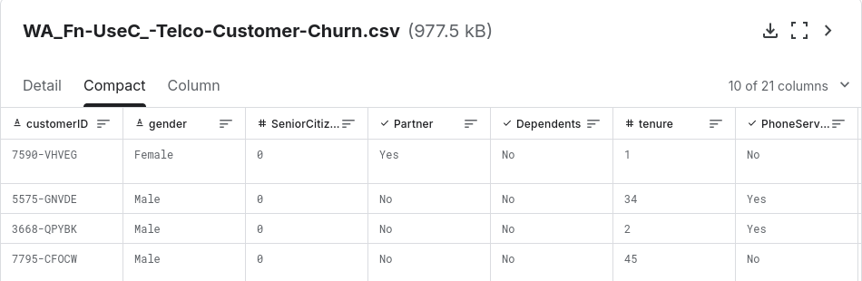</p>
</figure></p>

Przeczyszczone dane są następnie przekazywane do funkcji `prepare_data_splits()`:

`def prepare_data_splits(df):
    X = df.drop(columns=[TARGET_COLUMN]).values
    y = df[TARGET_COLUMN].values

    # Divide the data into train,test,validate subsets
    X_temp, X_test, y_temp, y_test = train_test_split(
        X, y, test_size=TEST_SIZE, random_state=RANDOM_STATE, stratify=y
    )

    val_ratio = VAL_SIZE / (1.0 - TEST_SIZE)
    X_train, X_val, y_train, y_val = train_test_split(
        X_temp, y_temp, test_size=val_ratio, random_state=RANDOM_STATE, stratify=y_temp
    )

    # scale data for NNs
    scaler = StandardScaler()
    X_train = scaler.fit_transform(X_train)
    X_val = scaler.transform(X_val)
    X_test = scaler.transform(X_test)

    return (X_train, y_train), (X_val, y_val), (X_test, y_test)`

Funkcja dzieli dane na trzy zbiory: zbiór treningowy, zbiór walidacyjny i zbiór testowy.

`class ChurnDataset(Dataset):
    def __init__(self, X, y):

        self.X = torch.tensor(X, dtype=torch.float32)

        # For binary classification pytorch need someithing like (n,1) instead of just (n)

        self.y = torch.tensor(y, dtype=torch.float32).unsqueeze(1)

    def __len__(self):
        return len(self.y)

    def __getitem__(self, idx):
        return self.X[idx], self.y[idx]

def get_dataloaders():

    df = load_and_clean_data(RAW_DATA_PATH)

    feature_names = df.drop(columns=[TARGET_COLUMN]).columns.tolist()

    #save modified data to temporaty file

    df.to_csv(PROCESSED_DATA_PATH, index=False)

    (X_train, y_train), (X_val, y_val), (X_test, y_test) = prepare_data_splits(df)

    # Dataloaders for python

    train_loader = DataLoader(ChurnDataset(X_train, y_train), batch_size=BATCH_SIZE, shuffle=True,drop_last=True)
    """drop_last=True fixes the Expected more than 1 value per channel when training, got input size torch.Size([1, 64])"""
    val_loader = DataLoader(ChurnDataset(X_val, y_val), batch_size=BATCH_SIZE, shuffle=False)
    test_loader = DataLoader(ChurnDataset(X_test, y_test), batch_size=BATCH_SIZE, shuffle=False)

    # XGboost dictionary for the selected training sets
    xgb_data = {
        "X_train": X_train, "y_train": y_train,
        "X_val": X_val, "y_val": y_val,
        "X_test": X_test, "y_test": y_test,
        "feature_names": feature_names  # <--- this is for the xgboost plot file
    }

    # we return input_dims here
    input_dim = X_train.shape[1]
    return train_loader, val_loader, test_loader, xgb_data, input_dim
`

Podzielone dane następnie są owijane w DataLoader (do pytorcha) czy zwracane w słowniku `xgb_data` (do xgboosta) 

### Wykresy

<p align="center"><figure class="figure"><p>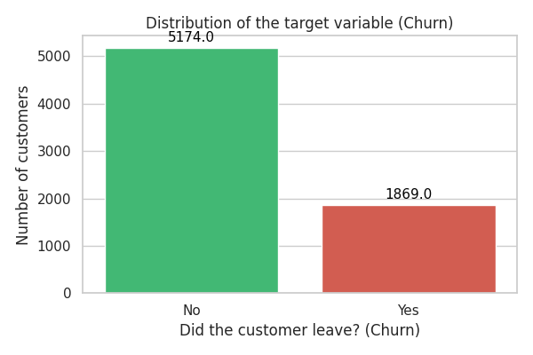</p>
</figure></p>

<p align="center"><figure class="figure"><p>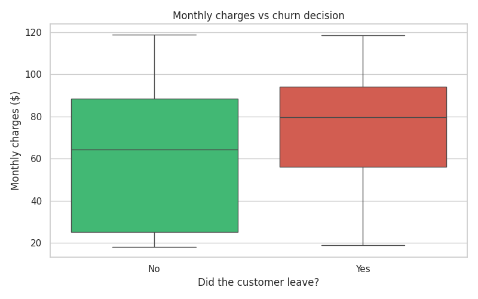</p>
</figure></p>

<p align="center"><figure class="figure"><p>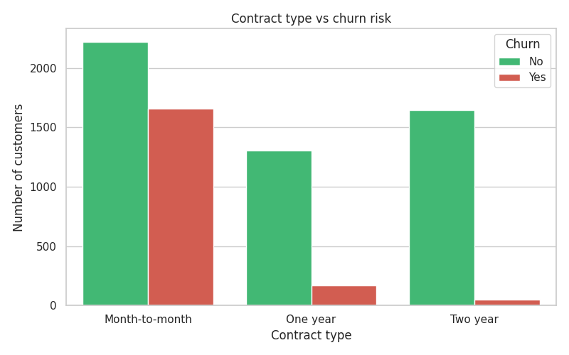</p>
</figure></p>

<p align="center"><figure class="figure"><p>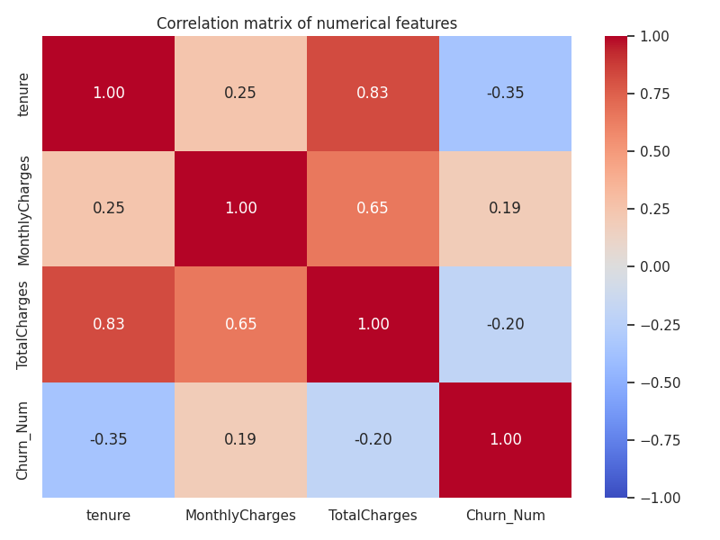</p>
</figure></p>

<p align="center"><figure class="figure"><p>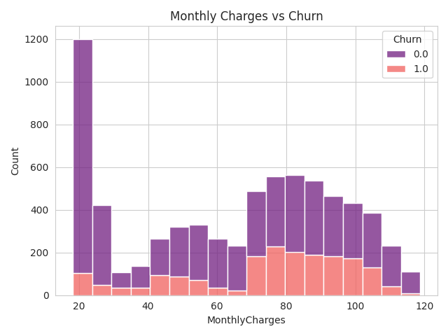</p>
</figure></p>

1. Wykres słupkowy (Distribution of Churn - Rysunek 3) - Balans klas:
   Co widać: 5174 klientów pozostało w firmie, a 1869 zrezygnowało. Wniosek: Rezygnację (churn) dotyczą około 26 - 27% klientów. Zbiór danych jest „niezbalansowany” (więcej lojalnych niż odchodzących), co później wymusi zmianę wag tych zmiennych w kodzie dla sieci XGBoost.
   1. Wykres pudełkowy (Monthly charges vs churn - Rysunek 4) - Opłaty miesięczne:Co widać: Pudełko dla odchodzących (Yes - czerwone) leży zauważalnie wyżej niż dla zostających (No - zielone). Wniosek: Klienci, którzy rezygnują z usług, mają zazwyczaj wyższe miesięczne rachunki (mediana ok. 80), niż ci którzy zostają (mediana ok. 65). Wyższe koszty sprzyjają ucieczce do konkurencji.

1. Pogrupowane słupki (Contract type vs churn risk - Rysunek 5) - Rodzaj umowy
   Co widać: Ogromna czerwona kolumna (Yes) przy umowach „Month-to-month”. Prawie brak czerwieni przy umowach na 2 lata. Wniosek: Klienci bez długoterminowego zobowiązania (z miesiąca na miesiąc) odchodzą masowo. Podpisanie umowy na rok lub dwa drastycznie zmniejsza ryzyko utraty klienta.

1. Mapa cieplna (Correlation matrix - Rysunek 6) - Korelacje liczbowe
   Co widać: Współczynniki zależności. Na przykład na przecięciu tenure i Churn\_Num mamy współczynnik korelacji równy −0.35. Wniosek: Istnieje ujemna korelacja między stażem a odejściem. Oznacza to, że im dłużej ktoś jest z firmą (wyższe tenure), tym mniejsze prawdopodobieństwo, że zrezygnuje.

1. Histogram ze stosami (Monthly Charges vs Churn - Rysunek 7) Co widać: “Duża fioletowa wieża” (zostający przy kwocie $20) oraz “szeroka różowa górka” (odchodzący w przedziale $70-$105). Wniosek: Uzupełnia to wykres pudełkowy. Firma ma ogromną rzeszę lojalnych klientów, którzy płacą bardzo mało (prawdopodobnie utrzymują najtańszą, podstawową usługę). Problem rezygnacji dotyka głównie klientów o średnich i wysokich rachunkach.

## Kamień Milowy 3

 

### Opis

 W ramach projektu zdecydowano się na podejście hybrydowe, implementując dwa niezależne modele, aby porównać skuteczność algorytmów drzewiastych z sieciami neuronowymi w zadaniu klasyfikacji binarnej (Churn: Tak/Nie).

Zaimplementowane modele:

- Konfiguracja XGBClassifier (XGBoost).
- Klasa ChurnNeuralNet (PyTorch).

### Model 1: XGBoost (Extreme Gradient Boosting)

**Dlaczego:** Jest to obecnie jeden z najskuteczniejszych algorytmów dla danych tabelarycznych. Świetnie radzi sobie z brakującymi danymi i nieliniowymi zależnościami.

- **Kluczowe cechy implementacji:**
  - Zastosowano **skalowanie wag klas (scale\_pos\_weight=2.76)**, aby zaradzić nierównowadze w zbiorze danych (więcej osób zostaje w sieci, niż z niej odchodzi).
  - Ustawiono parametry zapobiegające overfittingowi: max\_depth=4, subsample=0.8 oraz learning\_rate=0.05.
- **Plik:** `src/models/xgboost_model.py`

`import xgboost as xgb

def get_xgboost_model():
    """
    Initializes and returns an XGBoost model ready for training.
    """
    # We calculate the class weight based on  plot 1:
    # (Number of customers staying / Number leaving) = approx. 5174 / 1869 ≈ 2.76
    # This will help the model handle the minority class (churned customers) better

    model = xgb.XGBClassifier(
        n_estimators=100,  # Number of decision trees
        max_depth=4,  # Maximum tree depth (prevents overfitting)
        learning_rate=0.05,  # Learning rate
        subsample=0.8,  # Uses 80% of data to build each tree
        colsample_bytree=0.8,  # Uses 80% of features to build each tree
        scale_pos_weight=2.76,  # Class balancing!
        eval_metric="logloss",  # Evaluation metric during training
        random_state=42,  # Ensures reproducibility
        n_jobs=-1,  # Uses all CPU cores
    )

    return model
`

### Model 2: Głęboka Sieć Neuronowa (PyTorch)

 **Dlaczego:** Pozwala na wychwycenie bardzo złożonych, ukrytych korelacji między cechami, które mogą umknąć algorytmom drzewiastym.

- **Architektura (zaimplementowana w ChurnNeuralNet)**
  - **Warstwy:** Wejściowa -\> 64 neurony -\> 32 neurony -\> Wyjściowa (1 neuron).
  - **Regularyzacja:**Zastosowano warstwy **Dropout** (30% i 20%) oraz **Batch Normalization**, aby model był stabilny i nie „uczył się na pamięć” danych treningowych.
  - **Funkcja aktywacji:** ReLU dla warstw ukrytych.
- **Plik:** `src/models/xgboost_model.py`

`import torch
import torch.nn as nn

class ChurnNeuralNet(nn.Module):
    def __init__(self, input_dim):
        super(ChurnNeuralNet, self).__init__()

        # Define the network architecture
        self.network = nn.Sequential(
            # Input layer
            nn.Linear(input_dim, 64),
            nn.BatchNorm1d(64),
            nn.ReLU(),
            nn.Dropout(0.3), # Randomly disables 30% of neurons to prevent memorization

            # Hidden layer
            nn.Linear(64, 32),
            nn.BatchNorm1d(32),
            nn.ReLU(),
            nn.Dropout(0.2),

            # Output layer
            # 1 neuron, because we are doing binary classification (output is churn probability)
            nn.Linear(32, 1)
        )

    def forward(self, x):
        # Data passes through the network
        # We do not use a Sigmoid layer here, because in PyTorch we will use
        # BCEWithLogitsLoss, which is more numerically stable and includes Sigmoid internally!
        return self.network(x)
`

**Logika treningu (src/core/trainer.py)**

- Zaimplementowano ustandaryzowaną pętlę treningową z użyciem optymalizatora **Adam** oraz funkcji straty **BCEWithLogitsLoss** (idealna dla klasyfikacji binarnej w PyTorch).

### Wyniki

<p align="center"><figure class="figure"><p>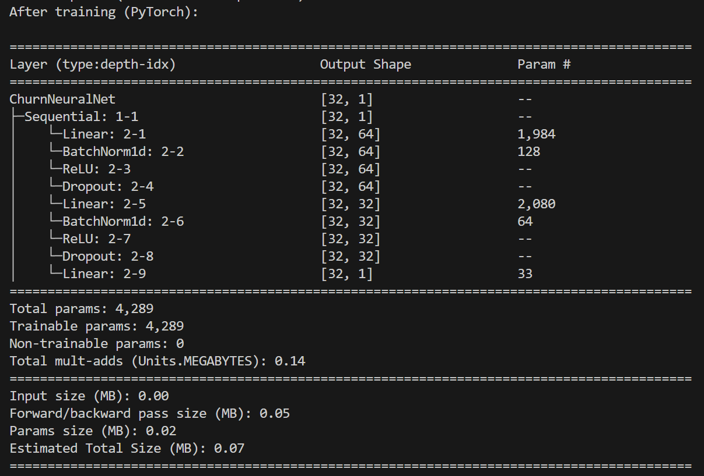</p>
</figure></p>

Modele są już zintegrowane z systemem metryk (Accuracy, F1-Score, Recall) w głównym skrypcie src/main.py. Wyniki dla obu modeli po podzieleniu datasetu na sekcje 70/15/15 (trening/test/walidacja) wyglądają następująco:

<p align="center"><figure class="figure"><p>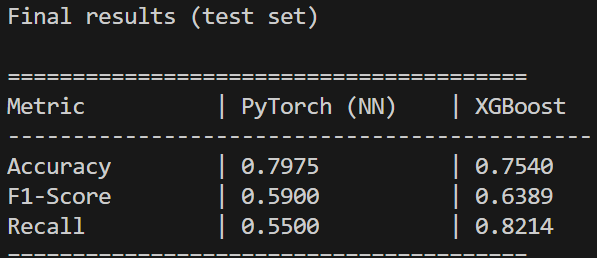</p>
</figure></p>

<p align="center"><figure class="figure"><p>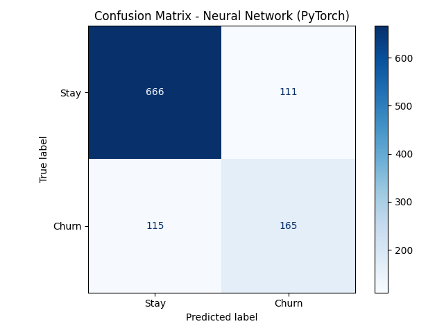</p>
</figure></p>

<p align="center"><figure class="figure"><p>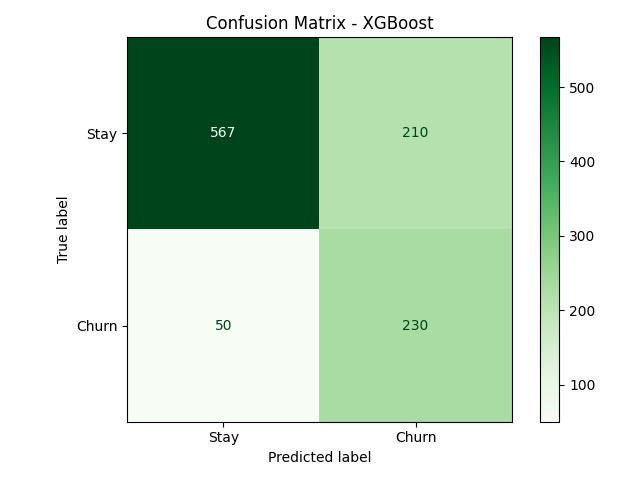</p>
</figure></p>

<p align="center"><figure class="figure"><p>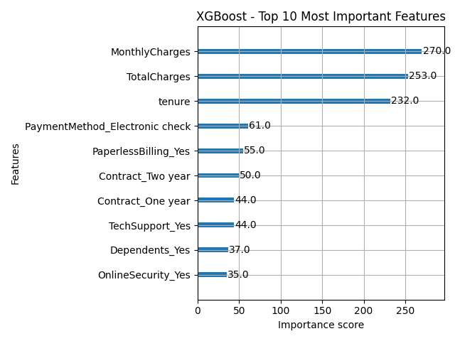</p>
</figure></p>

#### Opis Metryk

 **Accuracy (Dokładność)**

- **Co mówi:** Jaki procent wszystkich decyzji modelu był poprawny?
- **Wzór:** (Wszystkie dobre decyzje) / (Wszystkie przypadki)

Z danych wynika, że ponad 80% klientów nie kończy umowy z firmą. Model będzie wybierał sztywno tą opcję w celu uzyskania jak największej dokładności i może “okłamywać” resztę analizy. Tej mierze należy ufać tylko, gdy liczba klientów odchodzących i zostających jest mniej więcej równa.

**Recall (Czułość / Pełność)**

- **Co mówi:** Ile osób z tych, które naprawdę odeszły, nasz model zdołał poprawnie wskazać?
- **Wzór:** (Poprawnie wykryty Churn) / (Wszyscy, którzy faktycznie odeszli)

To jest prawdopodobnie najważniejsza metryka dla działu utrzymania klienta. Jeśli Recall wynosi 0.80, to znaczy, że zidentyfikowaliśmy 80% osób planujących odejście. Pozostałe 20% to „uciekinierzy”, których nie zauważyliśmy i niestety straciliśmy. Chcemy, aby Recall był jak najwyższy, żeby nie przegapić żadnego klienta, którego można jeszcze uratować promocją.

**F1-Score**

- **Co mówi:** To średnia (harmoniczna) z Recall i Precision. Szuka balansu.

Sam wysoki Recall łatwo oszukać. Wystarczy, że model stwierdzi, że każdy dany mu klient odjedzie. Wtedy Recall będzie równy 100%, ale model jest bezużyteczny, bo nie poprawnie klasyfikuje lojalnych klientów, którzy nie chcą kończyć umowy z firmą. F1-Score karze model za bycie zbyt ostrożnym lub zbyt agresywnym. Jeśli F1-Score jest wysoki, oznacza to, że model ma zarówno dobrą wykrywalność (Recall), jak i nie myli się zbyt często (Precision). To najlepsza metryka do ogólnego porównania, czy lepszy tutaj jest XGBoost, czy Sieć Neuronowa.

#### Ogólne Porównanie

 Mimo że sieć neuronowa (PyTorch) ma wyższą ogólną dokładność, to w tym konkretnym zadaniu (przewidywanie odejścia klientów) zdecydowanym zwycięzcą jest XGBoost.

- Accuracy (Dokładność):
  - PyTorch (79,75%) wypada lepiej niż XGBoost (75,40%).
  - Interpretacja: Sieć neuronowa rzadziej się myli ogółem, ale prawdopodobnie wynika to z tego, że jest bardzo „ostrożna” i najczęściej przewiduje, że klient zostanie (bo takich klientów jest w bazie najwięcej).

- Recall (Czułość):
  - XGBoost: (82,14%) przewyższa PyTorch: (55%).
  - Interpretacja: Tutaj jest najważniejsza różnica pomiędzy modelami. XGBoost poprawnie wykrywa aż 82% osób, które faktycznie chcą odejść. Sieć neuronowa wykrywa tylko 55% ,czyli prawie połowę uciekających klientów po prostu pomija. Tak wysoki wynik XGBoost to efekt zastosowania w kodzie parametru scale\_pos\_weight=2.76, który „zmusił” model do zwracania większej uwagi na klientów odchodzących.

- F1-Score:
  - XGBoost (63,89%) przewyższa PyTorch (59%).
  - Interpretacja: F1-Score potwierdza, że choć XGBoost częściej się myli (niższe Accuracy), to jego ogólna wartość użytkowa w balansowaniu wykrywania zjawiska “Churnu” w tym zbiorze danych jest większa.

## Kamień Milowy 4

 

### Wprowadzone zmiany

 

#### Zmiana samplingu danych

w `get_dataloaders.py` zamiast shuffle=True zastosowano WeightedRandomSampler

`    class_sample_count = np.array([len(np.where(y_train == t)[0]) for t in np.unique(y_train)])
    weight = 1. / class_sample_count # if the ammount of variables in each class is different, we need to adjust the weight
    samples_weight = np.array([weight[int(t)] for t in y_train])


    samples_weight = torch.from_numpy(samples_weight).double()
    sampler = WeightedRandomSampler(samples_weight, len(samples_weight))

    # Dataloaders for python

    train_loader = DataLoader(ChurnDataset(X_train, y_train), batch_size=BATCH_SIZE, shuffle=False,drop_last=True)
    # instead of shuffle=True, we use the sampler to ensure balanced sampling, set to True if results are worse
    """drop_last=True fixes the Expected more than 1 value per channel when training, got input size torch.Size([1, 64])"""
    val_loader = DataLoader(ChurnDataset(X_val, y_val), batch_size=BATCH_SIZE, shuffle=False)
    test_loader = DataLoader(ChurnDataset(X_test, y_test), batch_size=BATCH_SIZE, shuffle=False)`

**Dlaczego:**

- W danych o churnie mamy **silnie niezbalansowane** klasy - ok. 73% osób pozostaje, tylko ok. 27% osób odchodzi (Wykres - Rysunek 3).
  - `shuffle=True` losuje próbki losowo, ale nie zmienia rozkładu klas - nadal w każdej epoce model widzi **dużo więcej przykładów klasy dominującej**.- WeightedRandomSampler nadaje wagi próbkom **odwrotnie proporcjonalnie** do liczebności ich klasy. Dzięki temu w każdej epoce model widzi tyle samo przykładów z klasy mniejszościowej, co z większościowej.

- W efekcie model powinien nie ignorować klientów odchodzących, skutkując poprawieniem metryk

#### Zmniejszenie progu aktywacji `ChurnNeuralNet`

 Próg został zmniejszony z `0.5` do `0.4`.

```python
        nn_results = evaluate_pytorch(nn_model, test_loader, DEVICE, threshold=0.4)
```

**Dlaczego:**

- Domyślny 0.5 działa dobrze z założeniem, że klasy są tak samo prawdopodobne - co w naszym przypadku nie jest prawdą.
  - Dla niezbalansowanych danych, model często przewiduje niskie prawdopodobieństwo dla klasy mniejszościowej (np. 0.3). Przy progu 0.5 - żadna taka próbka nie zostanie zaklasyfikowana jako “odejście”.- Obniżenie progu do 0.4 zwiększa czułość (recall), czyli wykrywalność klientów, którzy **faktycznie odeszli**. Kosztem może być nieznaczny wzrost fałszywie pozytywnych, jednakże w analizowanym przez nas przypadku jest to akceptowalne - **najważniejsze jest, aby nie przegapić klientów którzy faktycznie odejdą.**

#### Zastąpienie `BCEWithLogitsLoss` przez `FocalLoss`

W pliku `trainer_pytorch.py` jako kryterium do trenowana zmieniono `BCEWithLogitsLoss` na `FocalLoss`

```py
  criterion = FocalLoss()
  # ...
  
  # ...
class FocalLoss(nn.Module):
    def __init__(self, alpha=0.25, gamma=2.0):
        super(FocalLoss, self).__init__()
        self.alpha = alpha
        self.gamma = gamma

    def forward(self, inputs, targets):
        BCE_loss = F.binary_cross_entropy_with_logits(inputs, targets, reduction="none")
        pt = torch.exp(-BCE_loss)
        F_loss = self.alpha * (1 - pt) ** self.gamma * BCE_loss
        return torch.mean(F_loss)
```

**Dlaczego:**

- Metoda Focal Loss została zaproponowana do detekcji obiektów w **silnie niezbalansowanych zbiorach**.
  - Redukuje wagę łatwych przykładów (gdzie model jest bardzo pewny klasy większościowej) i skupia się na trudnych, źle sklasyfikowanych przykładach (często należących do klasy mniejszościowej).

- Model uczy się lepiej rozpoznawać rzadkie, ale ważne przypadki churnu, nawet jeśli są one trudniejsze do odróżnienia.

#### XGBoost - Opuszczenie najmniej ważnych cech

XGBoost trenuje model, następnie odrzuca 40% najmniej ważnych cech, po czym następnie trenuje nowy model (pomijając odrzucone cechy).

`def train_and_eval_xgboost_with_feature_selection(
    xgb_model, xgb_data, drop_percent=30, verbose=False
):
    print("\n--- Starting XGBoost Training with feature selection ---")

    # First training to determine feature importance

    features = xgb_data["feature_names"]
    X_train_df = pd.DataFrame(xgb_data["X_train"], columns=features)
    X_val_df = pd.DataFrame(xgb_data["X_val"], columns=features)
    X_test_df = pd.DataFrame(xgb_data["X_test"], columns=features)

    # Initial training
    xgb_model.fit(
        X_train_df,
        xgb_data["y_train"],
        eval_set=[(X_val_df, xgb_data["y_val"])],
        verbose=False,
    )
    print("XGBoost training finished!")

    # Get feature importance
    importances = xgb_model.feature_importances_
    feature_importance_pairs = list(zip(features, importances))
    feature_importance_pairs.sort(key=lambda x: x[1], reverse=True)

    n_features = len(features)
    n_keep = max(1, int(n_features * (100 - drop_percent) / 100))

    top_features = [pair[0] for pair in feature_importance_pairs[:n_keep]]
    dropped_features = [pair[0] for pair in feature_importance_pairs[n_keep:]]

    # Retrain with only top features
    # Filter data to keep only top features
    feature_indices = [features.index(f) for f in top_features]

    X_train_filtered = xgb_data["X_train"][:, feature_indices]
    X_val_filtered = xgb_data["X_val"][:, feature_indices]
    X_test_filtered = xgb_data["X_test"][:, feature_indices]

    # Create new model (fresh training)
    from src.models.xgboost_model import get_xgboost_model

    xgb_model_filtered = get_xgboost_model()

    # Train on filtered data
    X_train_filtered_df = pd.DataFrame(X_train_filtered, columns=top_features)
    X_val_filtered_df = pd.DataFrame(X_val_filtered, columns=top_features)

    xgb_model_filtered.fit(
        X_train_filtered_df,
        xgb_data["y_train"],
        eval_set=[(X_val_filtered_df, xgb_data["y_val"])],
        verbose=False,
    )

    print("XGBoost re-training finished!")

    # Evaluate
    preds = xgb_model_filtered.predict(X_test_filtered)
    probs = xgb_model_filtered.predict_proba(X_test_filtered)[:, 1]

    results = {
        # ...
    }
    return results`

**Dlaczego:**

- Zbędne cechy mogą:
  - wprowadzać szum,
  - powodować lekkie przetrenowanie,
  - wydłużać czas treningu.

- Usunięcie najmniej ważnych cech upraszcza model, zmniejsza wariancję i może poprawiać generalizację.

### Porównanie wyników

<p align="center"><figure class="figure"><p></p>
</figure></p>

<p align="center"><figure class="figure"><p>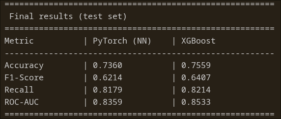</p>
</figure></p>

**Podsumowanie:**

- **Pytorch:**
  - Lekko pogorszone Accuracy (0.79 -\> 0.73)
  - Lekko zwiększony F1-Score (0.59 -\> 0.62)
  - **Znacznie polepszony Recall (0.55 -\> 0.82)**
  - Model znacznie polepszył swoją czułość; jest mniej podatny na błędy typu false negative, które dla firmy byłyby najbardziej kosztowne, skutkowały stratą klienta.
- **XGBoost:**
  - Lekko zwiększone Accuracy (0.754 -\> 0.756)
  - Lekko zwiększony F1-Score (0.639 -\> 0.641)
  - Recall - bez zmian (0.821)
  - Odrzucenie 40% najmniej ważnych charakterystyk przed trenowaniem modelu skutkowało małym wzrostem w Accuracy, ale nie miało wpływu na Recall
- Dodano dodatkową metrykę - ROC-AUC. Wykresy ROC - następna strona.
  - ROC-AUC ocenia jakość rankingową modelu klasyfikacyjnego - mówi, jak dobrze model odróżnić potrafi klasę pozytywną (w naszym przypadku - churn) od negatywnej (brak churnu).
  - Uzyskane przez nas wartości 0.84 (PyTorch) oraz 0.85 (XGBoost) wskazują, że model jest w stanie z dużym prawdopodobieństwem sklasyfikować osobę odchodzącą poprawnie.

<p align="center"><figure class="figure"><p>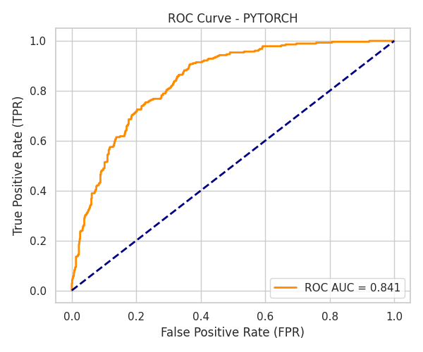</p>
</figure></p>

<p align="center"><figure class="figure"><p>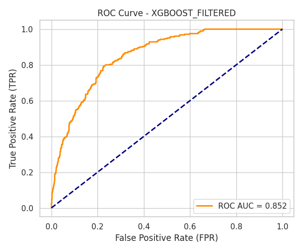</p>
</figure></p>
